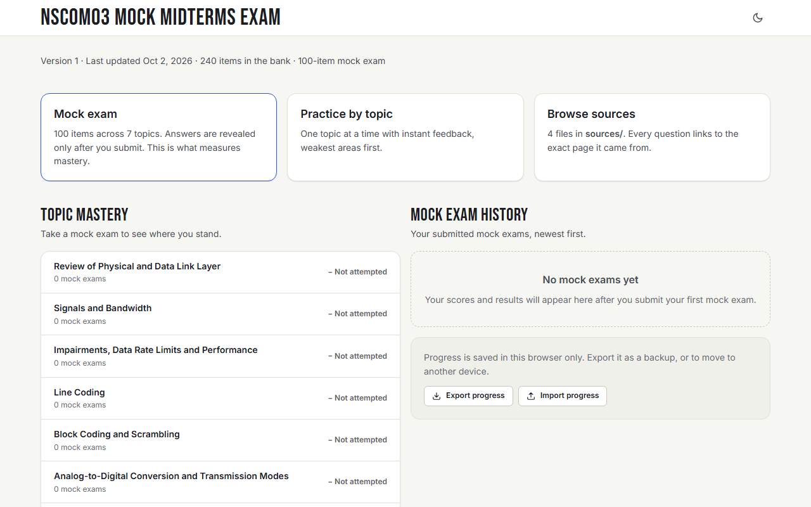
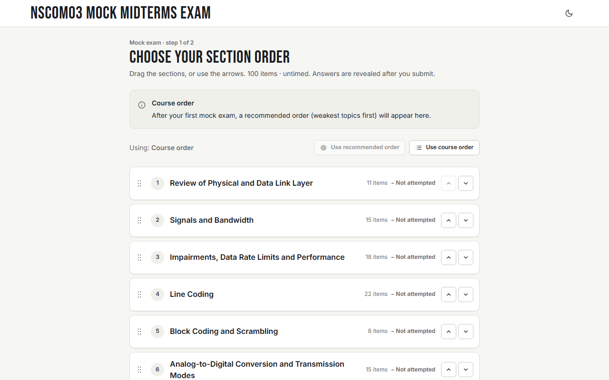
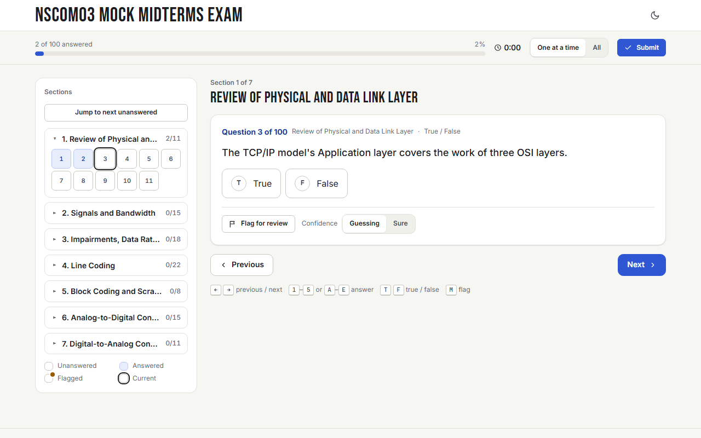
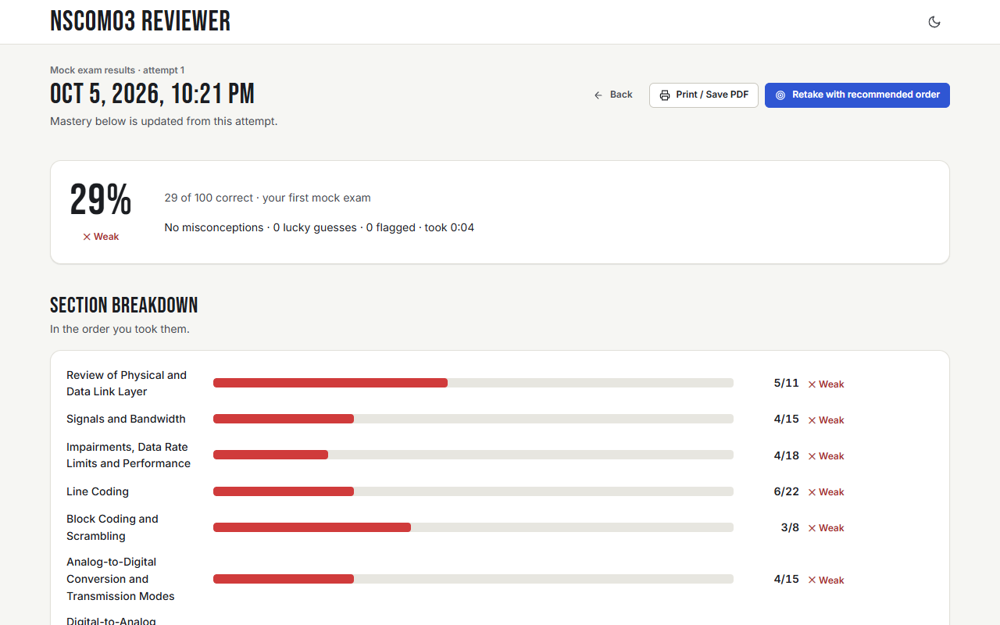

# NSCOM03 Mock Midterms Exam

Mock midterms exam and practice quizzes for NSCOM03. Open `NSCOM03-mock-midterms-exam.html` in any browser, or try it online at **https://aq7zo.github.io/NSCOM03-mock-exam/**.

Also linked: [Line Encoding Diagrams & Additional Notes (Miro board)](https://miro.com/app/board/uXjVEekzuEo=/?share_link_id=209019946829)

## Screenshots

| Home | Section order |
| --- | --- |
|  |  |
| **Question** | **Results** |
|  |  |

## The lecture slides are not included

The questions are based on the course slides, but the slides belong to the instructor and aren't mine to redistribute, so the `sources/` folder in this repo is empty.

**If you're also in Sir Jerome G.'s NSCOM03 class**, download the slides from your course page and drop them into `sources/` with these exact filenames:

```
sources/
├── NSCOM03-01 Review of Physical and Data Link Layer.pdf
├── NSCOM03-02 Physical Communication Layer.pdf
├── NSCOM03-03 Physical Communication Layer - Digital Transmission.pdf
└── NSCOM03-04 Physical Communication Layer - Digital to Analog Transmission.pdf
```

Once they're in place, each question's citation link opens the exact slide page it came from. Without them, the exam still works, but the citation links won't open anything.

Please don't open a PR that adds the slides. 

Goodluck on the exams! :)
